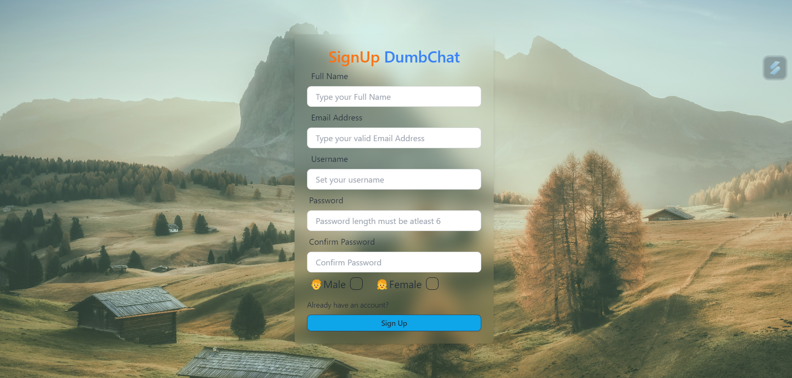
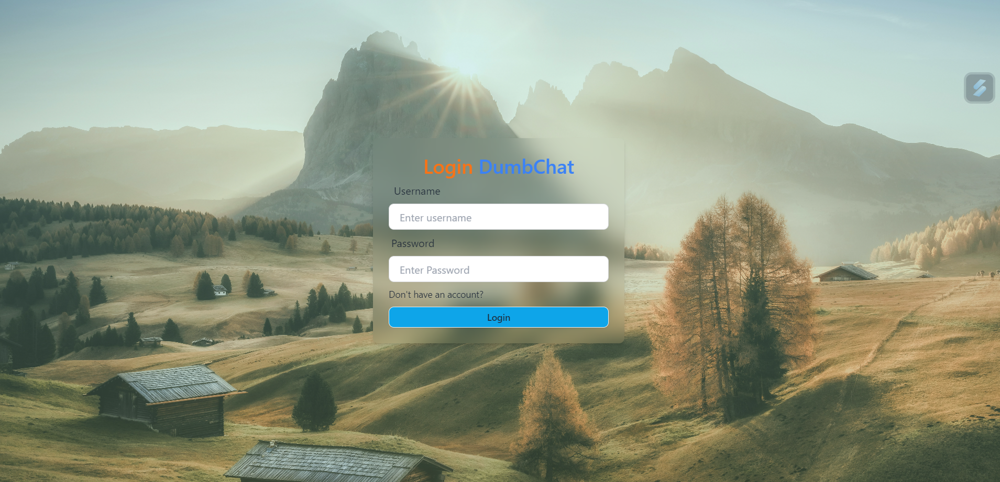
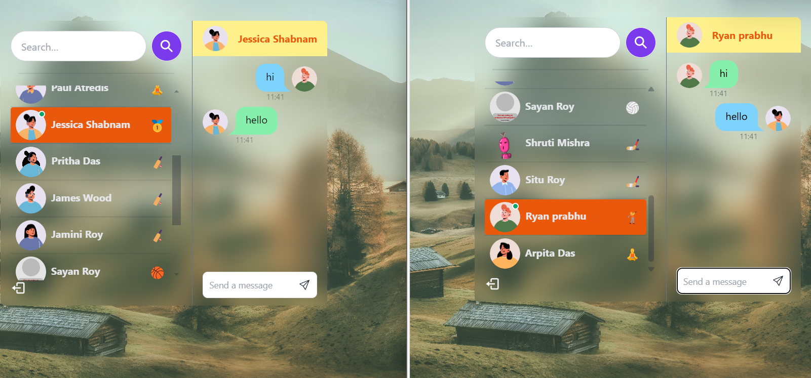

# DumbChat 

Some Features:

-   🌟 Tech stack: MERN + Socket.io + TailwindCSS + Daisy UI
-   🎃 Authentication && Authorization with JWT
-   👾 Real-time messaging with Socket.io
-   🚀 Online user status (Socket.io and React Context)
-   👌 Global state management with Zustand
-   🐞 Error handling both on the server and on the   client

About the Project

There is Signup page  where user can create there account with name, email, password.

Signup page :

  

there is Login page where user can login using username and password 

Login Page:

 

 After login user will see availabe users to chat and online users also

 Chat Opening:
 
 

 Users can do chat 

 chatting:

## Demo Video

Watch the demo video below:

<iframe src="https://vimeo.com/973962153" width="640" height="360" frameborder="0" webkitallowfullscreen mozallowfullscreen allowfullscreen></iframe>

## Installation

1.Open the folder chatapp

2.There are two folder frontend and backend.

3.set up .env file 

PORT=...
CONNECTION_STRING1=...
JWT_SECRET=...
NODE_ENV=...

5.Now  on root folder npm init

6.Now cd frontend

  npm init
  
7.Now in cd backend run the command   npx nodemon server.js

8.In frontend  run  command    npm run dev

Project should run , and setup accordingly if some issue arises.

You can connect frontend port other than 3000 as mentioned in folder as your available project.

 
